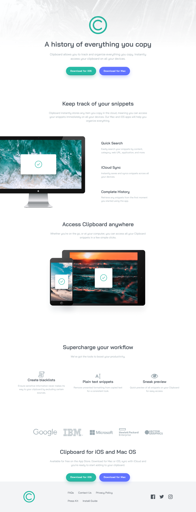

# Frontend Mentor - Solução da landing page Clipboard

Esta é uma solução para o desafio **Clipboard Landing Page** do [Frontend Mentor](https://www.frontendmentor.io).  
Os desafios do Frontend Mentor ajudam você a melhorar suas habilidades de programação construindo projetos realistas.

---

## Sumário

- [Frontend Mentor - Solução da landing page Clipboard](#frontend-mentor---solução-da-landing-page-clipboard)
  - [Sumário](#sumário)
  - [Visão geral](#visão-geral)
    - [Screenshot](#screenshot)
    - [Links](#links)
  - [Meu processo](#meu-processo)
    - [Construído com](#construído-com)
    - [O que aprendi](#o-que-aprendi)
    - [Desenvolvimento contínuo](#desenvolvimento-contínuo)
    - [Recursos úteis](#recursos-úteis)
  - [Autor](#autor)
  - [Agradecimentos](#agradecimentos)

---

## Visão geral

### Screenshot

---

### Links

- URL da solução: *(adicione aqui o link da sua solução no Frontend Mentor)*  
- URL do site ao vivo: *(adicione aqui o link do site publicado)*

---

## Meu processo

### Construído com

- HTML5 semântico
- CSS moderno
- CSS Grid
- Flexbox
- Propriedades personalizadas do CSS
- Abordagem desktop-first
- Design responsivo

---

### O que aprendi

Neste projeto, desenvolvi uma **landing page completa**, utilizando uma abordagem **desktop-first**, com foco em:

- Estruturação de múltiplas seções de conteúdo
- Organização de layouts complexos em telas grandes
- Uso combinado de CSS Grid e Flexbox
- Criação de hierarquia visual clara
- Fidelidade ao design proposto pelo desafio

Esse desafio foi importante para praticar **layouts de páginas institucionais**, muito comuns em produtos digitais.

---

### Desenvolvimento contínuo

Em projetos futuros, pretendo:

- Refinar ainda mais layouts desktop-first
- Melhorar a adaptação para telas menores
- Evoluir a organização do CSS em arquiteturas reutilizáveis
- Aplicar melhorias de acessibilidade
- Introduzir interações com JavaScript quando necessário

---

### Recursos úteis

- MDN Web Docs – Referência essencial para HTML e CSS  
- Frontend Mentor – Plataforma excelente para prática com projetos reais  
- CSS-Tricks – Conteúdos aprofundados sobre layout e responsividade  

---

## Autor

- GitHub – https://github.com/lanzincode  
- Frontend Mentor – https://www.frontendmentor.io/profile/lanzincode

---

## Agradecimentos

Agradecimentos ao **Frontend Mentor** por disponibilizar desafios completos e bem estruturados, ideais para praticar layouts reais e modernos em front-end.
